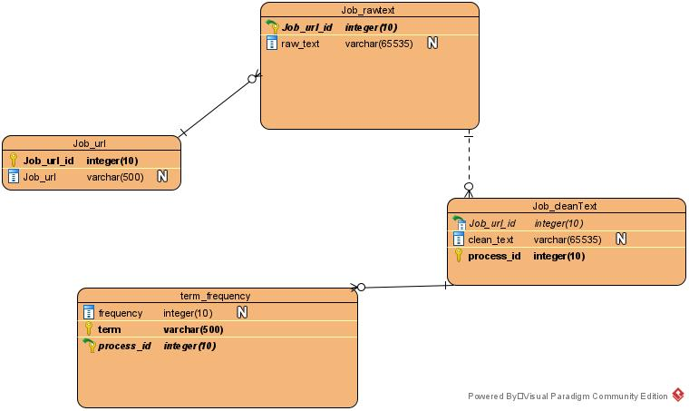

```{r setup, include=FALSE}
knitr::opts_chunk$set(echo = TRUE)
```

# Data Science Skills

**Team Triple J:** Jered Ataky, Zhouxin Shi, Irene Jacob

## Project Overview:

In this project, our goal is to be able to answer to the question:

“Which are the most valued data science skills?” 

As it is a group work and each member living in different time zone, we have 
established a great way of communication, code sharing, and documentation to
enable us to be successful and efficient while working virtually together.
The tools used and data source explored are described below: 

## Tools:

We are using Github for code sharing, and Google Cloud Platform (GCP)
for data base and storage.
In the other, Slack and Microsoft Teams are used for communication as well
project documentation.

## Data Source:

The data set we are working can be found in the link below:

https://www.kaggle.com/elroyggj/indeed-dataset-data-scientistanalystengineer
https://www.linkedin.com


We also have it loaded as csv in our Github repository for project development:

(https://github.com/szx868/Project3)


## ER Diagram



## Libraries

```{r load-packages, message=FALSE}
library(tidyverse)
library(kableExtra)
library(rvest)
library(stringr)
library(xtable)
library(tm)
library(RMySQL)
library(PGRdup)
library(broom)
library(googleCloudStorageR)
library(readr)
library(cloudml)
library(plotly)
library(SnowballC)

```


## Work process & responsabilities

```{r}

Process <- c('Data Collection', 'Database Storage & Structure ',
             'Data Transformation (Cleaning & Tidying data)',
             'Data Analysis', 'Visualization',
             'Review & Summary','Conclusion and Presentation')

Team <- c('Zhouxin', 'Zhouxin & Jered', 'Jered & Irene', 
          'Jered, Zhouxin, Irene', 'Irene', 'Jered',
          'Jered, Zhouxin, Irene')

df_team <- data.frame(Process, Team)

names(df_team) <- c('Process', 'Team Members')

df_team %>%
  kbl(caption = "Work Process & Responsabilities") %>%
  kable_material(c("striped", "hover")) %>%
  row_spec(0, color = "indigo")


```

## Approach


<style>
div.aquamarine { background-color:#7fffd4; border-radius: 10px; padding: 5px;}
</style>
<div class = "aquamarine">

**Data Acquisition & Storage**

We target a data set in kaggle and decided to work on, on top of that data set, 
We created a database in MySQL in a set of normalized tables and link 
it to our GCP data base to allow each one to access it locally and make any change if necessary.
Thus, data reside in both the GCP data base and storage we created.

Then, we extracted more data in linkedin by scraping it. This time, we scanned key words
(Keys words were defined in a csv file in Github).
and created an automation to feed the data base from r studio.


Since we had everything connected: local MySQL, GCP data base and storage,
we decide to load the data directly from the cloud to start data transformation.


See Appendix in the end for details and codes for the entire process.


**Data Transformation (Cleaning &  Tidying)**


The automation we created help us a lot to get data ready for tyding
(missing values were removed in advance, see Appendix).

For the rest, we used tidyverse library and stringr libraries.


**Data Analysis**

Tidying data in advance help this section to be pretty forward,
and we did two different analyses. 

**Extra & APPENDIX**


Extra section includes an extra analysis,
and the "Appendix" has codes used in data acquisition and storage


</div> \hfill\break


## Load the data

```{r}
# Load data from the cloud storage linked to GCP data base

raw_data <-read.csv("https://storage.googleapis.com/triplej_project3/Linkedin_dataset.csv")


```


```{r}
# data insight

glimpse(raw_data)


```


## Data Transformation


### Cleaning

```{r}

# Check for missing values

sum(is.na(raw_data))

data <- raw_data

```
### Tidying & Cleaning


```{r}

# Convert to string the variable job_skill & unlist


ds_skill3 <- gsub("\\s+","", data$job_skill ) # Clear the comma

ds_skill3 <-unlist(ds_skill3) # unlist the string 

ds_skill3 <- unlist(str_extract_all(ds_skill3, "\\w+[a-z]" )) # extract skills


```

```{r}
# New data frame

ds_skill <- data.frame(ds_skill3)

# summarise data frame

ds_skills <- ds_skill %>%
  group_by(ds_skill3) %>%
  summarise(count_skills = n())

```

```{r}

# save df

ds_final <- ds_skills

```
```{r}

# Rename columns and order desc per counts

names(ds_final) <- c('ds_top_skills', 'total_count')

ds_final <- ds_final %>%
  arrange(desc(total_count))

ds_final <- ds_final %>%
  mutate(percent_count= round((total_count / sum(total_count))*100, 1))

head(ds_final)
```


### Most valued data science skills table

```{r}

df <- ds_final

df %>%
  kbl(caption = "Most data science value skills") %>%
  kable_material(c("striped", "hover")) %>%
  row_spec(0, color = "indigo")

```


## Data Analysis


### Most valued data science skills plot


```{r}

ds_final %>%
  
  ggplot(aes(reorder(ds_top_skills, percent_count), percent_count)) +
  
  geom_col(aes(fill = percent_count)) +
  
  scale_fill_gradient2(low = "red",
                       high = "blue",
                       midpoint = median(ds_final$percent_count)) +
  
  
coord_flip() +

  
  labs(title = "Most data science value skills",
       x = "ds_top_skills")
  


```


### 10 top skills


```{r}
top_n(ds_final, n = 10) %>%
  
  ggplot(aes(reorder(ds_top_skills, percent_count), percent_count)) +
  
  geom_col(aes(fill = percent_count)) +
  
  geom_text(aes(label = percent_count)) +
  
  scale_fill_gradient2(low = "yellow",
                       high = "magenta",
                       midpoint = median(ds_final$percent_count)) +
  
  
coord_polar() +

  
  labs(title = "Top 10 valued data science skills (in percent)", x = NULL, y = NULL)
  

```

## Extra


### Data Science jobs by website

```{r}

data_site <- data %>%
  group_by(job_site) %>%
  summarise( n_jobs = n())
data_site

pc <- ggplot(data_site, aes  (x = "", y = n_jobs, fill = job_site)) +
  
  geom_bar(width = 1, stat = "identity")

pie <- pc + coord_polar("y", start = 0)

pie

```

### Data Science jobs by state


```{r}

data_state <- data %>%
  group_by(job_location) %>%
  filter(job_location != "REMOTE", job_location != " ") %>%
  summarise( n_jobs = n())

data_state <- data_state[order(-data_state$n_jobs), ]
data_state <- data_state[-c(10), ]


data_state %>%
  kbl(caption = "Data Science jobs by state") %>%
  kable_material(c("striped", "hover")) %>%
  row_spec(0, color = "indigo")

```

#### Plot 10 top state in data science jobs


```{r}

# Top 10 plot

top_n(data_state, n = 10) %>%
  
  ggplot(aes(reorder(job_location, n_jobs), n_jobs)) +
  
  geom_col(aes(fill = n_jobs)) +
  
  scale_fill_gradient2(low = "yellow",
                       high = "purple",
                       midpoint = median(ds_final$percent_count)) +
  
  
coord_flip() +

  
  labs(title = "Data scientist jobs per state (top 10)",
       x = "State")
  


```


#### A bit more extra: Mapping data science job in US

```{r}
# Note that there is abit more hand coding in this section
# For personal practice purpose


# Add missing states
dss <- data_state

job_location <- c('AK', 'MS', 'MT', 'ND', 'NH', 'OK', 'SD', 'VT', 'WV', 'WY')
n_jobs  <- c(0,0,0,0,0,0,0,0,0,0)

ds <- data.frame(job_location, n_jobs)

dff <- rbind(dss, ds)

names(dff) <- c('State', 'count_job')


# Export to csv: save it to Github and export it later for plot 
# (personal reference)

write.csv(dff, "jobs.csv", row.names = FALSE )

```


```{r}

# Import the file back

dd <- read.csv("https://raw.githubusercontent.com/szx868/Project3/master/jobs.csv")

# Plot the map

w <- list(color = toRGB("white"), width = 2)

g <- list(
  scope = 'usa',
  projection = list(type = 'albers usa'),
  showlakes = TRUE,
  lakecolor = toRGB('white')
)

p <- plot_geo(dd, locationmode = 'USA-states') %>%
  add_trace(
    z = ~count_job, locations = ~State,
    color = ~count_job, colors = 'Blues'
  ) %>%
  colorbar(title = "Number of jobs") %>%
  layout(
    title = 'Data science Jobs by State',
    geo = g
  )
p

```


## Findings


<style>
div.aquamarine { background-color:#7fffd4; border-radius: 10px; padding: 5px;}
</style>
<div class = "aquamarine">

Data science is a field that required many skills.
Note that hard skills ar not enough to be a data scientist.
As the "Top 10 valued data science skills" in data analysis section shows,
the top 10 most value data science skills are not only hard skills, but 
soft skills as well such as communication and business sens.


</div> \hfill\break

## Appendix 


<style>
div.aquamarine { background-color:#7fffd4; border-radius: 10px; padding: 5px;}
</style>
<div class = "aquamarine">

Below is the code for data collection and storage explained in "Approach"

We leave it purposely in not "r code" form to avoid running it.


</div> \hfill\break

```{}
library(RMariaDB)
# The connection method below uses a password stored in a variable.
# To use this set localuserpassword="The password of newspaper_search_results_user"

storiesDb <- dbConnect(RMariaDB::MariaDB(), user='root', password='Ja07071990', dbname='ds_skills', host='23.251.154.21')
# dbListTables(storiesDb)
query<- "SELECT * FROM indeed_job_dataset7;"
rsInsert <- dbSendQuery(storiesDb, query)
Indeed <- dbFetch(rsInsert) # extract data in chunks of 10 rows
# dbHasCompleted(rsInsert)
Indeed


```

```{}
for (i in 1:500){
 
  
  job_loc <- Indeed[i,4]
  print(job_loc)
  job_desc <- Indeed[i,1]
  job_url <- Indeed[i,3]
}
```

```{}
for (i in 1:500){
 
  
  job_loc <- Indeed[i,4]
  job_desc <- Indeed[i,1]
  job_url <- Indeed[i,3]
  job_skill <- '' 
  if(str_length(str_trim(job_loc)) > 2 ){
      job_loc <- 'NA'
    }
  for(x in 1:nrow(general.skill)){
    if(general.skill[x,1]!=''){
        if(str_detect(tolower(job_desc),tolower(general.skill[x,2])) == TRUE){
          job_skill <- paste(job_skill,general.skill[x,1],sep=", ")
        }
    }
  }
    for(x in 1:nrow(general.skill)){
      if(general.skill[x,3]!=''){
        if(str_detect(tolower(job_desc),tolower(general.skill[x,4])) == TRUE){
          job_skill <- paste(general.skill[x,3],job_skill, sep=", ")
        }
      }
  }
  query <- "INSERT INTO `Linkedin_dataset` (`job_url`,`job_site`,`job_skill`,`job_location`)VALUES('"
  value <- c(str_trim(job_url),'Indeed',str_trim(job_skill),str_trim(job_loc))
  value <- paste(value,collapse = "','")
  query <- paste(query,value )
  query <- paste(query, "');")
  rsInsert <- dbSendQuery(storiesDb, query)
  dbClearResult(rsInsert)
  #df <- rbind(df, data.frame(Skill =  job_skill , Loc = job_loc2[2] ))
  
}
```


```{}
dbClearResult(rsInsert)
dbDisconnect(storiesDb)

```

```{}
library(rvest)
library(stringr)
index <- 0
Linkedin<-matrix(nrow=0,ncol=1)
for(i in 1:30){
  start <- index*25 
  index <- index + 1
  strlink =paste("https://www.linkedin.com/jobs/search/?geoId=103644278&keywords=data%20scientist&location=United%20States&start=", toString(start),sep="")

  strhtml <- read_html(strlink)%>% html_nodes(".result-card__full-card-link") %>%html_attr('href')
  tempmatrix <- as.matrix(strhtml)
  Linkedin <- rbind(Linkedin,tempmatrix)
  
}
#Linkedin %>%
#html_nodes(".full-width") %>%
#html_text()


```

```{}
Linkedin
```


```{}
  temphtml <- read_html(Linkedin[2])
  job_desc <- temphtml %>%
  html_nodes(".description__text") %>%
  html_text()
  print(job_desc)
```

```{}
  temphtml <- read_html(Linkedin[1])
  job_desc <- temphtml %>%
  html_nodes(".sub-nav-cta__sub-text-container") %>%
  html_text()
  print(job_desc)
```
```{}
length(Linkedin)
```

```{}
general.skill <- read.csv("https://raw.githubusercontent.com/szx868/Project3/master/data_skills.csv",header=T)

names(general.skill) <- c('Soft', 'Reg.Soft','Hard','Reg.Hard')
general.skill
```
```{}
str(general.skill)
```
```{}
nrow(general.skill)
```

```{}
for(i in nrow(general.skill)){
  print(general.skill[2,1])
}
```

```{}
tempstr <- "asdfaCreative adfas Thinkingfsa "
str_detect(tempstr,pattern="creative.*Thinking")
```
```{}
nrow(Linkedin)
```

```{}
for (i in 1:nrow(Linkedin)){
  print(Linkedin[i])
}
```

```{}
library(RMariaDB)
# The connection method below uses a password stored in a variable.
# To use this set localuserpassword="The password of newspaper_search_results_user"

storiesDb <- dbConnect(RMariaDB::MariaDB(), user='root', password='Ja07071990', dbname='ds_skills', host='23.251.154.21')
# dbListTables(storiesDb)


# dbHasCompleted(rsInsert)


df = data.frame(Skill = character(), Loc = character())
for (i in 1:500){
 temphtml <- read_html(Linkedin[i])

  job_desc <- temphtml %>%
  html_nodes(".description__text") %>%
  html_text()
  print(job_desc)
  job_loc <- temphtml %>%
  html_nodes(".sub-nav-cta__sub-text-container") %>%
  html_text()
  
  job_loc2 <- unlist(strsplit(job_loc, ","))

  print(str_length(str_trim(job_loc2[2])))
  if(length(job_loc2)>=2){
    if(str_length(str_trim(job_loc2[2])) > 2 ){
      job_loc2[2] <- 'NA'
    }
  }
  print(job_loc2[2])
  
  job_skill <- '' 
  job_url <- Linkedin[i]
  for(x in 1:nrow(general.skill)){
    if(general.skill[x,1]!=''){
        if(str_detect(tolower(job_desc),tolower(general.skill[x,2])) == TRUE){
          job_skill <- paste(job_skill,general.skill[x,1],sep=", ")
        }
    }
  }
    for(x in 1:nrow(general.skill)){
      if(general.skill[x,3]!=''){
        if(str_detect(tolower(job_desc),tolower(general.skill[x,4])) == TRUE){
          job_skill <- paste(general.skill[x,3],job_skill, sep=", ")
        }
      }
  }
  query <- "INSERT INTO `Linkedin_dataset` (`job_url`,`job_site`,`job_skill`,`job_location`)VALUES('"
  value <- c(str_trim(job_url),'Linkedin',str_trim(job_skill),str_trim(job_loc2[2]))
  value <- paste(value,collapse = "','")
  query <- paste(query,value )
  query <- paste(query, "');")
  print(job_loc2[2])
  rsInsert <- dbSendQuery(storiesDb, query)
  dbClearResult(rsInsert)
  #df <- rbind(df, data.frame(Skill =  job_skill , Loc = job_loc2[2] ))
  
}

```


```{}
dbClearResult(rsInsert)
dbDisconnect(storiesDb)

```


```{}
docs <- df$x

```
```{}
ps_dtm <- VectorSource(docs) %>%
  VCorpus() %>%
  DocumentTermMatrix(control = list(removePunctuation = TRUE,
                                    removeNumbers = TRUE,
                                    stopwords = TRUE))
```

```{}
inspect(ps_dtm)

```


```{}
ps_tidy <- tidy(ps_dtm)
ps_tidy
```


